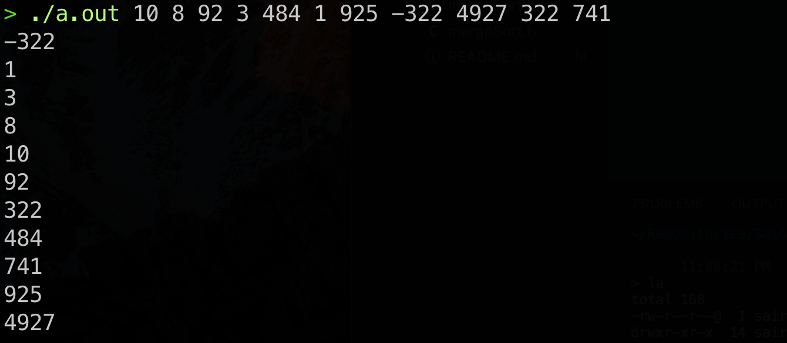

# Merge Sort in C++
My first algorithms project after completing C++ data structures

Make sure to first compile the program with a command like: g++ -I ./ *.cpp

Then, when running the out file (a.out), make sure to type only integers formatted as such:
